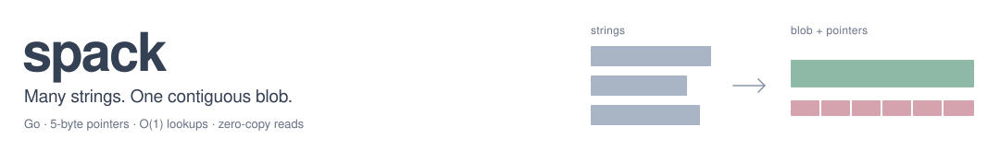
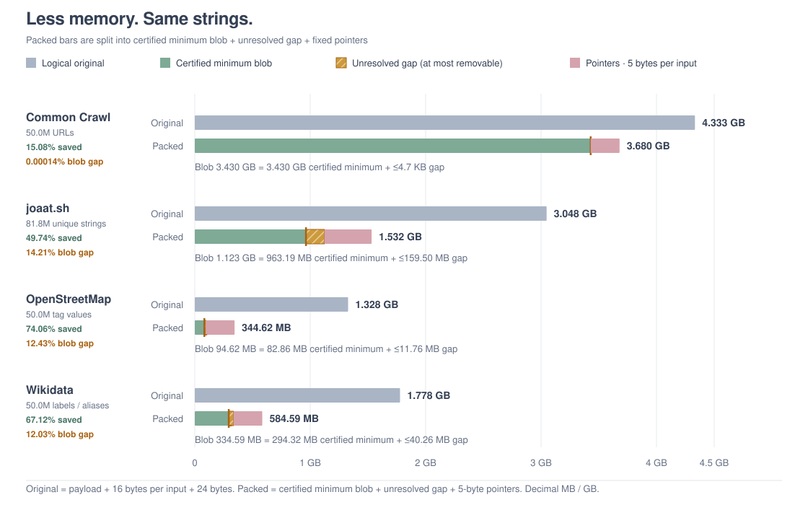

<picture>
  <source media="(prefers-color-scheme: dark)" srcset=".github/banner.svg">
  <source media="(prefers-color-scheme: light)" srcset=".github/banner-light.svg">
  
</picture>

spack is a minimal, high-performance string pack library for Go. It packs a collection of strings into a single, contiguous byte slice by deduplicating equal values and exploiting prefix, suffix, internal substring and suffix-to-prefix overlap relationships.

The resulting blob is flat, coherent and highly optimized for writing to a file and memory mapping (mmap).

## Key Features

* Single Coherent Blob: Packing emits a single byte slice and an array of compact 3-, 5- or 9-byte pointers. Perfect for direct disk serialization and zero-copy mmap.
* O(1) Lookups: Retrieving strings is a flat, simple offset lookup.
* Standalone Usability: GetString and GetStringUnsafe are decoupled from any struct. They operate directly on raw byte slices using Pointer16, Pointer32 or Pointer64, facilitating easy integration with mmap libraries.
* Zero Allocation Options: Unsafe retrieval returns views over the original block using Go string headers to avoid allocation.

## Performance

`spack` is benchmarked against several large, real-world corpora with substantially different string distributions:

* **Common Crawl URLs:** 50 million URL occurrences from the CC-MAIN-2026-34 columnar URL index. Duplicate occurrences are preserved and URLs are not normalized.
* **joaat.sh GTA V extraction:** 81.8 million unique strings extracted from 41.3 GB of GTA V/FiveM-oriented source code, scripts, build data and hash databases. This represents the original workload for which `spack` was developed.
* **OpenStreetMap tag values:** 50 million tag-value occurrences from Geofabrik extracts of Germany, Japan, Brazil and South Africa, balanced at 12.5 million values per region. Tag keys are excluded and duplicate values are preserved.
* **Wikidata labels and aliases:** 50 million multilingual label and alias occurrences from the 2026-08-31 entity dump. Descriptions, entity IDs and language codes are excluded; duplicate occurrences are preserved.

Values longer than 255 bytes are rejected rather than truncated.

| Corpus | Inputs | Logical input | Blob | Packed total | Blob-only saving | Total saving | Pack time |
|---|---:|---:|---:|---:|---:|---:|---:|
| Common Crawl URLs | 50.0M | 4.333 GB | 3.430 GB | 3.680 GB | 20.85% | 15.08% | 23.567 s |
| joaat.sh GTA V extraction | 81.8M | 3.048 GB | 1.123 GB | 1.532 GB | 63.16% | 49.74% | 34.146 s |
| OpenStreetMap tag values | 50.0M | 1.328 GB | 94.62 MB | 344.62 MB | 92.88% | 74.06% | 2.333 s |
| Wikidata labels and aliases | 50.0M | 1.778 GB | 334.59 MB | 584.59 MB | 81.18% | 67.12% | 6.008 s |

Sizes use decimal units (`1 MB = 1,000,000 bytes`, `1 GB = 1,000,000,000 bytes`). Packing times measure `Pack` only, with corpus loading and memory monitoring excluded.

<picture>
  <source media="(prefers-color-scheme: dark)" srcset=".github/chart.svg">
  <source media="(prefers-color-scheme: light)" srcset=".github/chart-light.svg">
  
</picture>

On this 64-bit system, the logical unpacked size is calculated as:

`string payload bytes + 16 × input count + 24`

The packed total below uses `Pointer32`:

`blob bytes + 5 × input count`

Accordingly, **blob-only saving** compares the blob against the logical unpacked representation and includes the removal of Go string headers. It is not a raw-payload compression ratio. **Total saving** includes the 5-byte `Pointer32` required for every input string.

## Usage

```go
package main

import (
	"fmt"
	"github.com/coalaura/spack"
)

func main() {
	// collect strings
	sm := spack.NewStringMap(nil)

	idx1, _ := sm.Add("hello world")
	idx2, _ := sm.Add("world")

	// pack strings into a flat blob
	packed, err := sm.Pack[spack.Pointer32]()
	if err != nil {
		panic(err)
	}

	rawBytes := packed.Bytes()
	pointers := packed.Pointers()

	// independent, O(1) lookups on the raw bytes
	str1, _ := spack.GetStringUnsafe(rawBytes, pointers[idx1])
	str2, _ := spack.GetStringUnsafe(rawBytes, pointers[idx2])

	fmt.Println(str1) // "hello world"
	fmt.Println(str2) // "world"
}
```

The pointer type is explicit: `Pointer16`, `Pointer32`, and `Pointer64` use 16-, 32-, and 64-bit blob offsets while retaining the same 8-bit string length. Choose the smallest type whose offset range can hold the packed blob.

`Pack` performs explicit garbage collections between memory-intensive phases by default. Disable those calls when latency is more important than reducing peak memory usage:

```go
packed, err := sm.Pack[spack.Pointer32](spack.PackOptions{DisableGC: true})
```

## Constraints

Individual strings cannot exceed 255 bytes (`MaxStringLen` is constrained by the 8-bit pointer length field). Packing returns `ErrBlobTooLarge` if any final string offset exceeds the selected pointer type's range.
